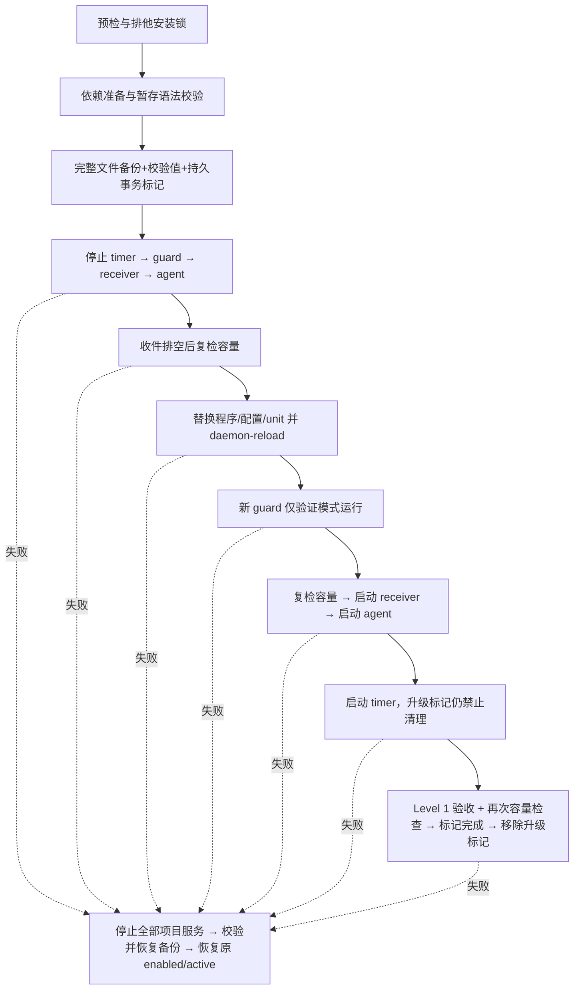

# v1.1 → v1.2 生产升级 SOP

**执行前提：维护窗口与部署审批已获批准，并先在具有真实 systemd 的隔离 VM 上演练。** 仓库 CI 的真实 rsyslog 测试不等于 systemd 完整升级测试。本轮开发没有在生产执行以下命令。

所有命令在 Debian 以 root 执行；示例采用默认 `/srv/netblackbox`，自定义 data_dir 必须按当前配置替换。升级不登录 ImmortalWrt，不改 Docker、路由、DNS、firewall，不 reboot Debian/PVE。

## 1. 确认候选版本与现状

在源码副本中准备已审阅的精确 commit（先将占位 SHA 替换为批准值）：

```bash
CANDIDATE_SHA='替换为批准的完整40位SHA'
git fetch origin feature/v1.2-syslog-reliability
git checkout --detach "$CANDIDATE_SHA"
test "$(git rev-parse HEAD)" = "$CANDIDATE_SHA"
test -z "$(git status --porcelain)"
cat VERSION
cat /opt/netblackbox/VERSION
systemctl is-active netblackbox netblackbox-syslog netblackbox-logrotate.timer
systemctl is-enabled netblackbox netblackbox-syslog netblackbox-logrotate.timer
python3 -m json.tool /etc/netblackbox/install-state.json
netblackbox config
```

不要把实际 config、cloud URL、机器日志或备份提交到 Git。确认时间语义：`date -Is`；receiver、Agent、guard 应使用相同服务器时区，不加独立 `TZ` override。本版保留本地日期日志名，事件 UTC 不变。

检查磁盘、预算及控制标记：

```bash
df -h /srv/netblackbox
du -sh /srv/netblackbox/syslog /srv/netblackbox/incidents
python3 -m json.tool /etc/netblackbox/config.json
ls -l /srv/netblackbox/state/syslog-storage*.json
./install.sh --check
```

首次预检检查：数据目录及关键子目录无 symlink、由 root 拥有且不可被组/其他用户写入；文件系统可写；syslog 占用及剩余空间；预算；兼容配置；端口归属；服务状态；旧 install-state/完整 rollback manifest/已有备份文件。masked 或过渡/未知服务状态拒绝猜测。不存在的单元只允许新安装。预检不会删除、轮转、写 lock 或重启服务。

已有受管理 syslog 达到/超过候选预算、容量统计未知、缺少旧备份或有未完成升级标记时停止。调整候选配置：

```bash
cp -a /etc/netblackbox/config.json ./edited-site.json
chmod 600 ./edited-site.json
editor ./edited-site.json
./install.sh --config ./edited-site.json --replace-config --check
```

预算要高于现有占用并有增长余量；不要只为通过检查而设置超过磁盘能力的数值。原日志只能按批准的归档计划处理，安装器不会自动删除它们。

## 2. 备份并验证可读性

选择有足够空间的**独立备份存储**挂载点，替换 BACKUP_BASE；不要在即将满的系统盘再复制一份全部日志。

```bash
BACKUP_BASE='/mnt/backup/netblackbox'
stamp=$(date -u +%Y%m%dT%H%M%SZ)
backup="$BACKUP_BASE/$stamp"
install -d -m 700 "$backup"
cp -a /etc/netblackbox "$backup/etc-netblackbox"
cp -a /opt/netblackbox "$backup/opt-netblackbox"
cp -a /etc/systemd/system/netblackbox* "$backup/"
systemctl show netblackbox netblackbox-syslog netblackbox-logrotate.timer \
  -p Id -p ActiveState -p UnitFileState > "$backup/service-states.txt"
sqlite3 /srv/netblackbox/db/netblackbox.sqlite3 ".backup '$backup/netblackbox.sqlite3'"
sqlite3 "$backup/netblackbox.sqlite3" 'PRAGMA integrity_check;'
```

取得一致的文件证据备份时会开始短暂停写窗口；UDP 在此时可能丢失，提前与客户约定：

```bash
systemctl stop netblackbox-logrotate.timer
systemctl stop netblackbox-logrotate.service
systemctl stop netblackbox-syslog.service
systemctl stop netblackbox.service
tar -C /srv/netblackbox -czf "$backup/evidence.tar.gz" syslog incidents exports state db
tar -tzf "$backup/evidence.tar.gz" > "$backup/evidence-files.txt"
sha256sum "$backup/evidence.tar.gz" "$backup/netblackbox.sqlite3" > "$backup/SHA256SUMS"
sha256sum -c "$backup/SHA256SUMS"
python3 -m json.tool "$backup/etc-netblackbox/config.json" >/dev/null
python3 -m json.tool "$backup/etc-netblackbox/install-state.json" >/dev/null
systemctl start netblackbox-syslog.service
systemctl start netblackbox.service
systemctl start netblackbox-logrotate.timer
```

上述 restart 假设三个单元之前全部 active（步骤 1 已确认）。若原状态不同，按 `service-states.txt` 恢复，不擅自启动管理员停用的 receiver。任何备份步骤失败，先恢复原运行状态并排查，不继续升级。禁止先删除原目录来“腾空间”。

保留候选源码（含 `manage.py`）及旧程序备份；rollback 入口不依赖已经被覆盖的 `/opt/netblackbox`。

## 3. 执行升级

```bash
./install.sh --check
./install.sh
# 如选择了编辑过的配置，则两条命令均加入 --config ./edited-site.json --replace-config
```

安装流程与中断窗口：



D 到 H 的 receiver 启动是收件中断阶段。旧 reader/writer/guard 全部停止且状态确认后才替换文件，避免正常升级路径中混用版本。容量在最初预检、收件排空后、启动前、验收后重查；解决了旧 receiver 持续收件造成的主要 TOCTOU 窗口，但无法阻止其他程序并发占用共享盘，运行期阈值也不是硬配额。

新 guard 在升级标记存在且安装器进程仍活着时，仅做容量/标记校验，不轮转、不删过期归档、不自动 stop/start receiver。Agent 在升级标记存在时也只报告容量，不执行旧 metrics/events/incident 清理。这样后续失败回滚不会先丢掉旧证据。timer 在 receiver/Agent 启动后、Level 1 验收前启动，使验收能检查真实 active 状态；此时升级标记仍禁止清理。升级完成移除标记才恢复正常维护。

## 4. 升级后验收

```bash
netblackbox health
netblackbox status
netblackbox syslog-status
curl --noproxy '*' --max-time 5 http://127.0.0.1:9911/syslog
ss -tunlp | grep -E ':(5514|9911)[[:space:]]'
python3 verify.py --network
systemctl is-enabled netblackbox netblackbox-syslog netblackbox-logrotate.timer
systemctl status netblackbox netblackbox-syslog netblackbox-logrotate.timer --no-pager
journalctl -u netblackbox -u netblackbox-syslog -u netblackbox-logrotate --since '10 minutes ago' --no-pager
python3 -m json.tool /srv/netblackbox/state/syslog-storage.json
```

非默认端口/目录按配置调整。`verify.py` 验证 SQLite 持续写入与本机收件；未知监听状态不等于 HEALTHY。缺少日志可能是设备安静，不能据此判网络坏。

在批准范围内执行分层验收（[SYSLOG-ACCEPTANCE.md](SYSLOG-ACCEPTANCE.md)）：

- 从另一台 LAN 主机发送唯一标识，Debian 核对实际源 IP/时间/内容与重复数。
- 管理员在 ImmortalWrt **手工**运行工具生成的 logger 命令；本安装器不登录路由器、不修改配置。
- `python3 /opt/netblackbox/simulate_failure.py` 在独立 exports 数据库验证 incident 自动生成与 T+0/15/60/恢复快照，不断开真实网络；随后检查该目录的 `test-result.json`、snapshot 的 `complete.json`。
- 可用 `netblackbox snapshot` 检查人工快照文件；不把它当自动触发验收。
- 运行 `systemctl start netblackbox-logrotate.service` 是正常维护（会按保留策略清理**过期**归档），需在备份之后。不要直接 `logrotate -f` 绕过锁。已有日志达到大小/日期条件时观察归档，再发一条低量标记确认继续收件；没有达到条件则轮转验证标记 NOT_TESTED，不能在生产造海量日志。
- 30秒以上后复查 guard `checked_at`、pressure、暂停归属、recovery_error/manual_intervention；检查未出现意外暂停。

## 5. 立即回滚条件和命令

以下情形应终止升级并回滚/人工介入：新 receiver/Agent 启动失败、guard 验证失败、Level 1 失败、当前数据超过新预算、容量统计未知、观察到证据路径/监听异常，或保留策略与预期不符。不要不断重试 install 来覆盖错误。

正常异常（包括 KeyboardInterrupt/SIGTERM）会执行回滚。`SIGKILL`/`os._exit`/主机掉电不能被 Python 捕获：完整备份和阶段标记保留，后续安装拒绝继续，必须手工恢复。候选单元已替换时，其启动检查会拒绝失去 owner 的升级标记。**不声称任意掉电时刻都有原子整机回滚保证**；尤其旧 v1.1 单元尚未替换的窗口没有新启动检查，应先禁止未审查的自动启动，再按以下入口恢复。

查找准确事务入口：

```bash
python3 -m json.tool /srv/netblackbox/state/upgrade-in-progress.json
# 上一步输出的 manifest 路径；已完成升级可读 install-state.json 的 latest_install
python3 -m json.tool /etc/netblackbox/install-state.json
MANIFEST='/srv/netblackbox/state/installations/替换为此次事务目录/manifest.json'
python3 -m json.tool "$MANIFEST"
python3 manage.py rollback "$MANIFEST"
```

使用**本次候选源码**中的 manage.py，而非旧版本管理器。回滚先校验备份路径和 SHA256，再按 timer→guard→receiver→Agent 停止；停止失败则不在运行中的进程下覆盖文件，明确报错需人工介入。文件恢复/daemon-reload 失败也不盲目启动。

恢复原程序、配置、unit 与原 active/enabled（包括 enabled-runtime），static oneshot 不误执行 enable/disable。升级时保存的 pause/error 控制状态会恢复；新状态先归档到事务的 runtime-after，observer/SQLite/syslog/incident 不删除。旧 v1.1 不读取新 observer 状态。

回滚结束再次执行服务、监听、本机/远端标记、SQLite 检查。回到 v1.1 也意味着原 `rotate 30` 风险回来；若存在高流量，按批准的运维方案暂停旧轮转并安排修复，不在本 SOP 中清空日志。

## 6. Guard 暂停与恢复

预算到临界或磁盘不足时，只有原先运行的 receiver 才会被 guard 接管暂停；管理员已停服务时不取得自动启动权。暂停后先清理允许删除的已关闭过期归档，再复算容量；满足恢复阈值可同一轮自动启动。启动失败显示 recovery_error/manual_intervention，至少 300 秒后再试，避免快速循环。

损坏/无法解析的暂停标记保留原文件，创建 `state/syslog-storage-error.json`，停止写入并阻止自动恢复。管理员从备份修复标记及容量后：

```bash
python3 -m json.tool /srv/netblackbox/state/syslog-storage.json
python3 /opt/netblackbox/syslog_storage.py --clear-error
# clear-error 只解除验证通过的错误标记，不直接启动 receiver
systemctl start netblackbox-syslog.service
systemctl start netblackbox-logrotate.service
netblackbox syslog-status
```

不得随意删除 pause marker 或修改 budget 来绕过真正的容量风险。标记写失败但停止成功时，事件可能仅在 journal/API 错误中可见；缺少可靠所有权时不会擅自启动已停止服务，需要管理员检查后启动。
